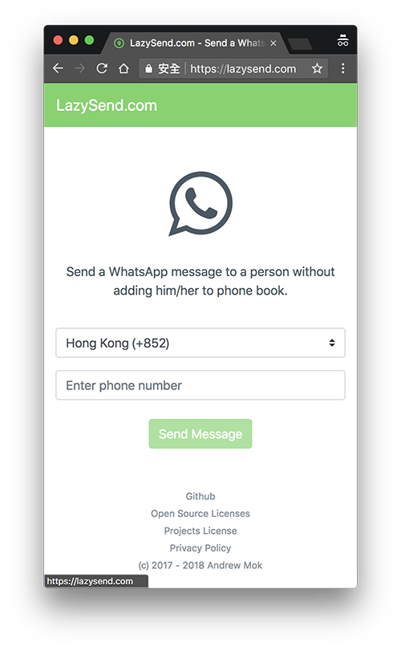

# Add9u.com

> It is so stupid that I have to add a new person every time to phone book because of just sending a WhatsApp message.
> 
> That's why I make this simple progressive web application. It allows you to send a WhatsApp message to a person without adding him/her to the phone book.



## Live Demo
- [Add9u.com](https://add9u.com)

It is a progressive web application. Just directly add it to your home screen if you have an Android device.

Want a quicker way? You can directly add the phone number with country code after `https://add9u.com/whatsapp/`.

Take a phone number `94340634` with country code `+852` as an example:
```
https://add9u.com/whatsapp/85294340634
```

## Clone & Install
The instructions below will get you a copy of the project up and run on your machine. See below for notes on how to deploy the project on a live system.

Clone the repo, and run
``` bash
# install dependencies
npm install

# serve with hot reload at localhost:8080
npm run dev

# build for production with minification
npm run build

# build for production and view the bundle analyzer report
npm run build --report
```

## Built With
- [Bootstrap](https://github.com/twbs/bootstrap)
- [Bootstrap-vue](https://github.com/bootstrap-vue/bootstrap-vue)
- [Node-sass](https://github.com/sass/node-sass)
- [Vue](https://github.com/vuejs/vue)
- [Vue-awesome](https://github.com/Justineo/vue-awesome)
- [Vue-cli](https://github.com/vuejs/vue-cli)
- [Vue-router](https://github.com/vuejs/vue-router)


## Coding Standards

- [JavaScript Standard Style](https://standardjs.com)

## Authors

- [Andrew Mok](https://andrewmmc.com) <hello@andrewmmc.com>

## Declaration
This is NOT an official product by WhatsApp Inc. Any communication between users and WhatsApp servers is handled by official WhatsApp application. It only provides a shortcut for users to open official WhatsApp application by using API links.

## Questions?
- If you have any questions, please feel free to [contact me via email](mailto:hello@andrewmmc.com).